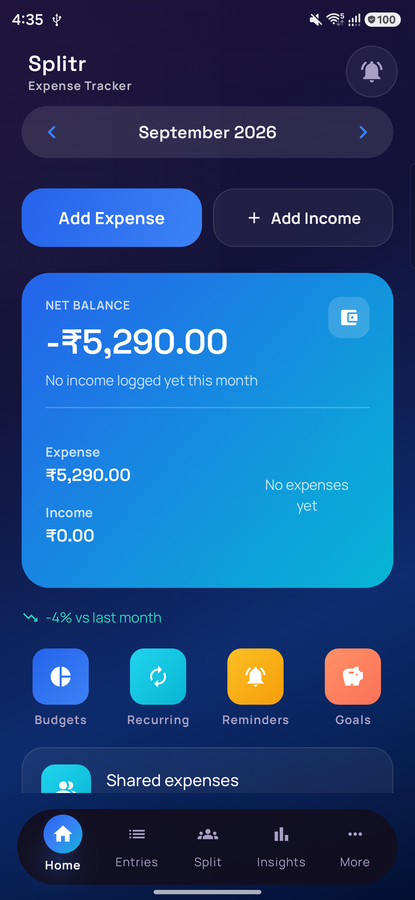
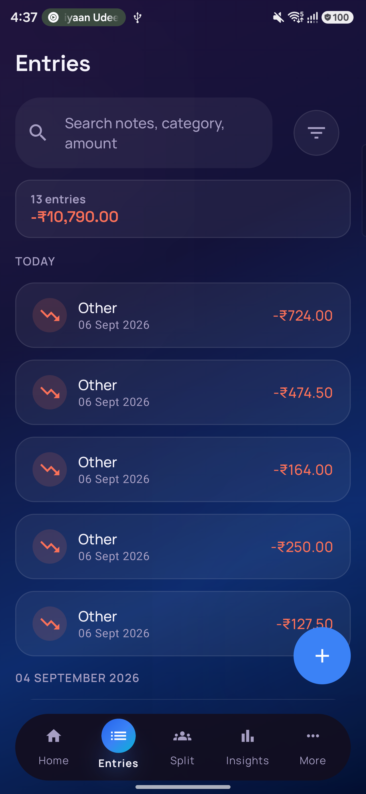
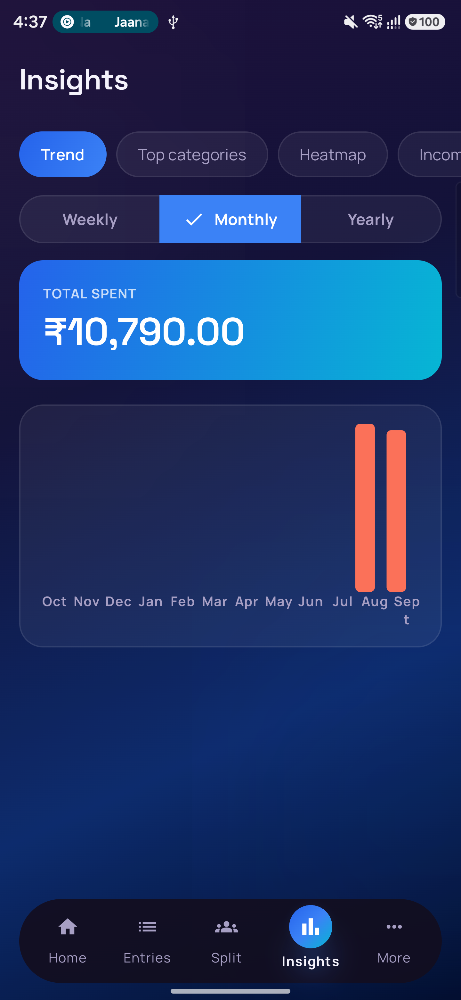
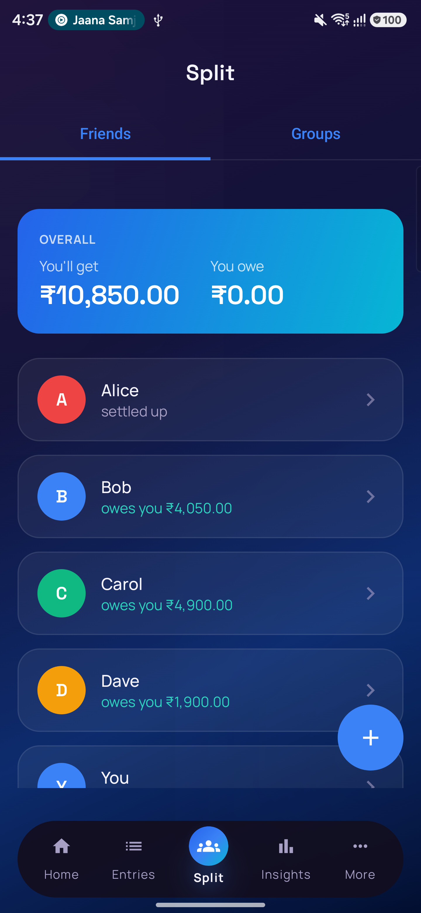
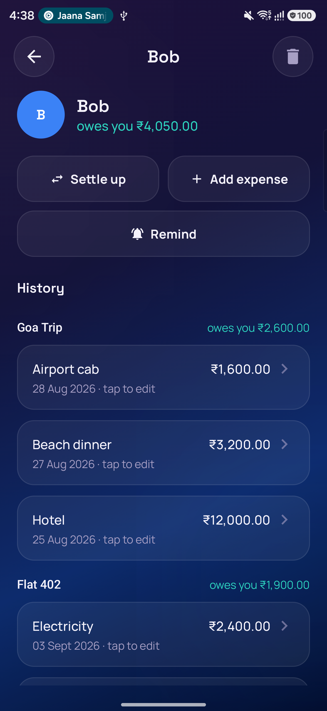
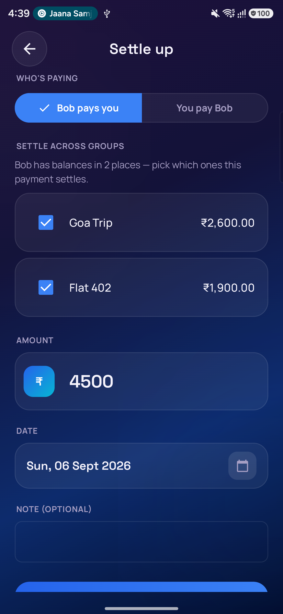
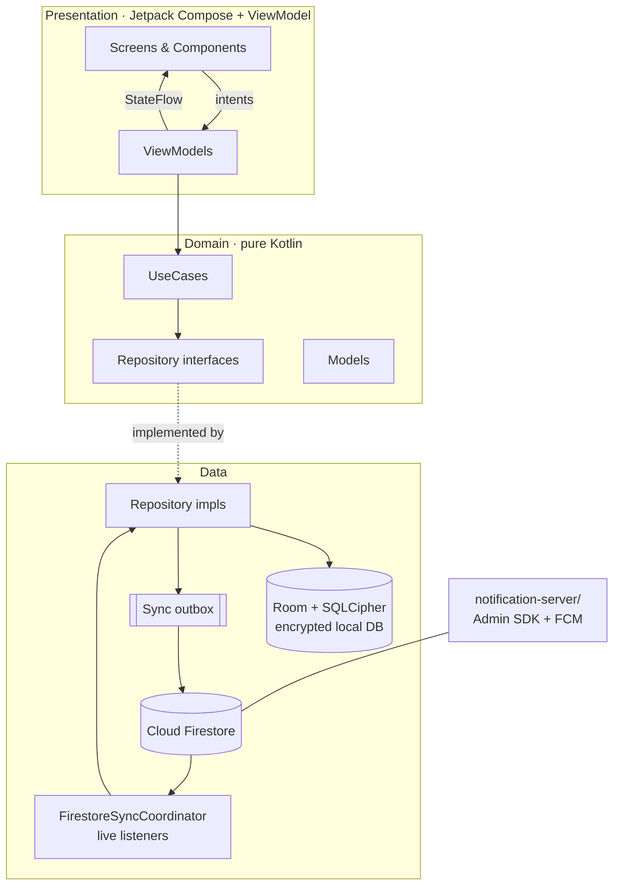

<div align="center">


# Splitr

### Personal **and** shared finance for Android — offline-first, private, zero paid cloud plan

[](https://developer.android.com)
[](https://kotlinlang.org)
[](https://developer.android.com/jetpack/compose)
[](https://dagger.dev/hilt/)
[](https://developer.android.com/training/data-storage/room)
[-FFCA28?logo=firebase&logoColor=black)](https://firebase.google.com/)
[]()
[](LICENSE)

Track every rupee, split expenses with friends and groups, budget, and save —
all working **fully offline**, syncing across your devices when you sign in, with an
**encrypted** local database and a push-notification bridge that runs on Firebase's free tier.

</div>

---

## Table of contents

- [Screenshots](#screenshots)
- [Highlights](#highlights)
- [Feature tour](#feature-tour)
- [Architecture](#architecture)
- [How sync works](#how-sync-works)
- [Tech stack](#tech-stack)
- [Project structure](#project-structure)
- [Getting started](#getting-started)
- [Testing](#testing)
- [Roadmap](#roadmap)
- [Contributing](#contributing)
- [License](#license)

---

## Screenshots

<table>
  <tr>
    <td align="center" width="33%"><br/><sub><b>Dashboard</b> — month totals, quick access, shared-balance card</sub></td>
    <td align="center" width="33%"><br/><sub><b>Entries</b> — searchable, grouped by day</sub></td>
    <td align="center" width="33%"><br/><sub><b>Insights</b> — spend trend, categories, heatmap</sub></td>
  </tr>
  <tr>
    <td align="center"><br/><sub><b>Split</b> — overall owed / owe + per-friend balances</sub></td>
    <td align="center"><br/><sub><b>Friend detail</b> — balance <i>per group</i>, tap-to-edit history</sub></td>
    <td align="center"><br/><sub><b>Settle up</b> — one payment allocated across the groups you owe</sub></td>
  </tr>
</table>

<details>
<summary><sub>Adding / updating screenshots</sub></summary>

Portrait, same device, ~1080&nbsp;px wide. Drop PNGs into `docs/screenshots/` with these names —
the table above references them directly:

| File | Screen |
|---|---|
| `01-dashboard.png` | Home / dashboard |
| `02-entries.png` | Entries list with the search bar |
| `03-insights.png` | Insights (a chart in view) |
| `04-split.png` | Split ▸ Friends (overall + per-friend balances) |
| `05-friend-detail.png` | A friend ▸ per-group sections + history |
| `06-settle-up.png` | Settle up with the multi-group picker |

```bash
adb exec-out screencap -p > docs/screenshots/01-dashboard.png
```
</details>

---

## Highlights

| | |
|---|---|
| 🔒 **Private by default** | Everything works offline. The local database is **encrypted at rest with SQLCipher**. Cloud sync is opt-in (sign in) and your personal data lives under `users/{uid}/…` — only you can read it. |
| 👥 **Real expense splitting** | Groups and one-to-one, five split modes, per-group balances, and a **debt-simplification** algorithm that minimises the number of payments to settle up. |
| 🔁 **Cross-device sync** | Sign in on two devices → entries, budgets, goals, recurring rules, categories, friends, groups, shared expenses and settlements stay in step. Offline-first via a **sync outbox**; conflicts resolve last-write-wins. |
| 📊 **Analytics that mean something** | Trends, category breakdowns, month-over-month deltas, a weekday spending heatmap, savings-rate over time, and anomaly flags for unusual spends. |
| 🔔 **Push notifications on the free tier** | Firestore triggers need Firebase's paid plan. Splitr ships a tiny Node bridge (`notification-server/`) that listens with the Admin SDK and sends FCM — production-grade alerts at **$0**. |
| 🧱 **Clean, tested core** | Clean Architecture + MVI, pure-Kotlin domain layer, 20+ test files covering split math, debt simplification, balance invariants, recurring generation and budget thresholds. |

---

## Feature tour

### Personal finance
- Fast income / expense entry — amount, date, **category, free-text note, and a receipt photo**
- Search across notes, categories and amounts; filter by type, category and date range
- Soft-delete with one-tap **undo**
- Custom categories with icons and colours; a seeded **Savings** category
- **Recurring rules** (rent, salary, subscriptions) — any interval, pause, skip-next, end date; generated automatically by a daily worker
- **Bill reminders** with lead-time notifications
- **Biometric app lock** (fingerprint / face / device credential), re-prompts on every foreground

### Split with friends
- Add friends by email — they resolve to a real account once they sign up with the same address
- Groups for trips, flats, teams; add expenses inside a group **or** directly with one friend (no group)
- Split modes: **Equal · Exact · Percentage · Shares · Itemised**, with multiple payers per expense
- **Per-group balances** — settle a specific group from its Balances tab, or settle at the friend level and let Splitr **allocate the payment across the groups** you owe (largest first; pick which groups to include)
- Debt simplification per group — fewest transactions to zero everyone out
- Comments on expenses and a group activity feed
- Contributions to a savings goal are mirrored as an expense under **Savings**, so goal money still counts toward that day's spend

### Budgets & goals
- Per-category and overall monthly budgets with progress bars and warning / breach alerts
- Savings goals with a target date, contribution log, pace tracking and "behind schedule" nudges

### Analytics
- Spending trend (line / bar), category donut, month-over-month change, weekday heatmap, savings-rate trend, anomaly detection — charts by **Vico**

### Productivity
- **Home-screen widgets** (Jetpack Glance): balance summary + a transparent **Quick Add** shortcut
- First-run **onboarding** (fresh install only)
- **Settings**: app lock, replay onboarding, full local data reset
- Full **JSON backup / restore**

---

## Architecture

Clean Architecture with a unidirectional (MVI-style) presentation layer. The domain layer is
pure Kotlin — no Android, no Room, no Firebase — so the money math is trivially testable.



**Design decisions**

- **Offline-first, always.** Every write hits Room first and is enqueued to a local *sync
  outbox*. Draining the outbox to Firestore is the only place a network call happens, and it is
  gated by a feature flag + sign-in.
- **Encrypted at rest.** Room runs on a SQLCipher `SupportFactory`.
- **Ledger integrity.** Every shared-expense / settlement change runs in one Room transaction
  that writes the row, applies balance deltas and appends an activity-log entry — a balance can
  never drift from the expenses that produced it, even after repeated edits.
- **Deterministic pure functions** for the tricky bits: `SplitCalculator`, `DebtSimplifier`,
  `SettlementAllocator` — each independently unit-tested.
- **Real Room migrations** (`MIGRATION_1_2 … MIGRATION_9_10`); no destructive fallback except on downgrade.

---

## How sync works

Three moving parts.

**1 · Outbox (local, always on).**
Every friend / group / expense / settlement / entry / budget / goal / recurring-rule / category
mutation writes a `sync_queue` row keyed by `type:id` (so bursts collapse) and schedules a
`CloudSyncWorker`.

**2 · Push & pull (Firestore).**
`CloudSyncWorker` drains the outbox: personal data → private `users/{uid}/{collection}/{id}`
docs; shared data → top-level `groups` / `sharedExpenses` / `settlements` keyed by a
`memberUids` array so linked friends receive it too. `FirestoreSyncCoordinator` keeps live
snapshot listeners and merges remote writes back through each repository's `upsertFromRemote`
— the same transactional path a local edit takes. Echoes from this device are skipped via a
per-device id; conflicts resolve last-write-wins by `updatedAt`.

**3 · Notification bridge (`notification-server/`).**
A long-lived Node process (Render / Fly.io free tier) using the Firebase **Admin SDK** —
`onSnapshot` reads and `messaging.send` are both free on the Spark plan, so you get real-time
"new shared expense" / "settlement recorded" / "reminder" pushes without upgrading to Blaze.
See [`notification-server/README.md`](notification-server/README.md).

---

## Tech stack

| Area | Choice |
|---|---|
| Language | Kotlin 2.2, Coroutines + Flow |
| UI | Jetpack Compose, Material 3, Navigation-Compose |
| Architecture | Clean Architecture + MVI |
| DI | Hilt (+ Hilt-Work, Hilt-Navigation-Compose) |
| Local storage | Room + **SQLCipher** (encrypted), DataStore (preferences) |
| Remote | Cloud Firestore, Firebase Auth (Email + Google Sign-In), Firebase Cloud Messaging |
| Background | WorkManager |
| Charts | Vico |
| Widgets | Jetpack Glance |
| Images | Coil |
| Security | AndroidX Biometric |
| Testing | JUnit4, MockK, Turbine, Compose UI Test, Espresso, Room-testing, Hilt-testing |
| Min / Target SDK | 24 / 37 · JDK 11 |

---

## Project structure

```
app/src/main/java/com/omer/expensetracker/
├── domain/                 # pure Kotlin — no Android
│   ├── model/              #   entities & value types (incl. split/)
│   ├── repository/         #   interfaces
│   └── usecase/            #   split, insights, budget, goal, recurring, reminder, backup, category
├── data/
│   ├── local/              #   Room DB, DAOs, entities, Migrations.kt, seeders
│   ├── mapper/             #   entity ⇄ domain
│   ├── repository/         #   implementations (incl. split/ and sync/)
│   └── debug/              #   sample-data seeder
├── presentation/           # 100% Compose — one package per screen
│   ├── dashboard/ entrylist/ addedit/ insights/ budget/ goal/ recurring/ reminder/
│   ├── split/              #   friend/, group/, expense/, activity/, components/
│   ├── settings/ onboarding/ security/ backup/ account/ auth/ more/
│   ├── navigation/ components/ util/
├── di/                     # Hilt modules
├── work/                   # WorkManager workers + schedulers
├── widget/                 # Glance widgets + Quick Add
├── notification/           # NotificationHelper, FcmService
└── security/               # AppLockManager

notification-server/        # Node.js FCM bridge (Firebase Admin SDK)
```

---

## Getting started

### Prerequisites
- **Android Studio** — a build recent enough for `compileSdk 37` (Canary/Preview channel), or
  lower `compileSdk`/`targetSdk` to 35 in `app/build.gradle.kts`
- **JDK 17+** to run Gradle (the project compiles to JVM 11 bytecode)

### 1 · Clone
```bash
git clone https://github.com/ANUJOMER21/expensetracker.git
cd expensetracker
```

### 2 · Firebase
1. Create a project in the [Firebase console](https://console.firebase.google.com/)
2. **Authentication** → enable *Email/Password* and *Google*
3. **Firestore Database** → create (production mode) and deploy the rules:
   ```bash
   firebase deploy --only firestore:rules
   ```
4. Download **`google-services.json`** into `app/`

> The app also runs **without** Firebase — `FeatureFlags.CLOUD_SYNC_ENABLED = false` disables
> sign-in and sync, leaving a fully functional offline app.

### 3 · Run
Open in Android Studio, let Gradle sync, run on a device / emulator (API 24+).

```bash
./gradlew :app:assembleDebug        # build
./gradlew :app:testDebugUnitTest    # unit tests
```

### 4 · Notifications (optional)
Deploy the bridge from [`notification-server/README.md`](notification-server/README.md) and keep
it warm with a free uptime pinger.

---

## Testing

Pure-logic unit tests live in `app/src/test/` (17 files) and instrumented tests in
`app/src/androidTest/` (6 files). The highest-value suites:

| Suite | Guards |
|---|---|
| `SplitCalculatorTest` | every split mode's shares sum **exactly** to the total |
| `DebtSimplifierTest` | greedy simplification zeroes every balance in ≤ *n−1* payments |
| `SettlementAllocatorTest` | a friend-level payment splits across groups, largest first, remainder handled |
| `BalanceInvariantTest` | the ledger stays net-zero; edits & deletes fully reverse |
| `GenerateDueRecurringEntriesUseCaseTest` | recurring generation is idempotent across catch-ups |
| `EvaluateBudgetThresholdsUseCaseTest` | warning / breach fire once per month |

```bash
./gradlew test                      # all unit tests
./gradlew connectedAndroidTest      # instrumented (needs a device)
```

---

## Roadmap

- [ ] Accounts / wallets and transfers between them
- [ ] Multi-currency
- [ ] CSV / spreadsheet export; include split data in the JSON backup
- [ ] Cross-device sync for bill reminders
- [ ] Attachments gallery (browse every receipt photo)
- [ ] `MigrationTestHelper` coverage for all migrations
- [ ] Tablet / landscape layouts

---

## Contributing

Contributions are welcome.

1. Open an issue first for anything non-trivial so we can agree on the approach
2. `git checkout -b feature/short-name`
3. Keep the domain layer Android-free; add tests for new logic
4. `./gradlew testDebugUnitTest` green before opening the PR
5. `git commit` → `git push` → open a Pull Request

---

## License

MIT — see [LICENSE](LICENSE).

<div align="center">

Built by [**Anuj Omer**](https://github.com/ANUJOMER21) · if it's useful to you, a ⭐ is appreciated.

</div>
